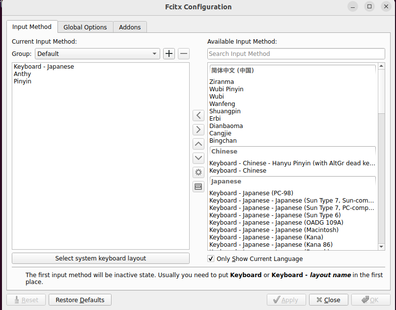

## 创建并启用虚拟内存
### 32GB虚拟内存
```
sudo fallocate -l 32G /swapfile
sudo chmod 600 /swapfile
sudo mkswap /swapfile
sudo swapon /swapfile
```
### 关闭并删除
```
sudo swapoff /swapfile
sudo rm /swapfile
```
### 开机自动挂载
```
/etc/fstab：
/swapfile none swap sw 0 0
```
### 配置swap使用策略及缓存回收策略
```
/etc/sysctl.conf:
vm.swappiness=0
vm.vfs_cache_pressure=100
```
### 更改生效
```
sudo sysctl -p
```
### 临时修改
```
sudo sysctl vm.swappiness=10
```
### 查看当前设置
```
cat /proc/sys/vm/swappiness
```



### 系统设置安装中文和日文支持并从IBUS改为使用fcitx5


